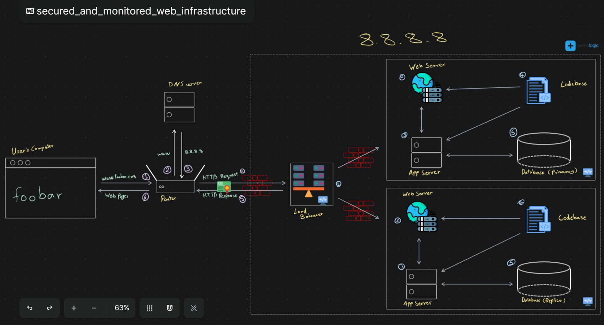

# Secured and Monitored Three-Server Web Infrastructure

**Scenario:** A user wants to visit the secured website www.foobar.com

## Components
* **User's Computer:** Initiates the request by typing the website URL
* **Internet:** Carries the request from the user's computer
* **Domain Name System (DNS):** Translates "www.foobar.com" into the server's IP address "8.8.8.8"
* **Firewall (x3):** Each server (load balancer, web servers) has a firewall to filter incoming and outgoing traffic, blocking suspicious activity
* **Load Balancer (HAproxy):** Distributes incoming requests evenly across two web servers. It uses a Round Robin algorithm by default
	- **SSL Termination (Optional):** The load balancer can be configured to handle SSL termination, decrypting HTTPS traffic before sending it to the web servers. (Security Consideration, see explanation below)
* **Web Server (Nginx) (x2):** Two web servers configured to handle HTTPS requests (if SSL termination is not on the load balancer). They retrieve static website files and communicate with the application server
* **Application Server:** Handles dynamic content generation (using the codebase) and interacts with the database
* **Application Files (Codebase):** Contains the website's functionality and appearance code
* **Database (MySQL) - Primary-Replica Cluster:**
	- **Primary Node:** The master database that stores all the original data and handles write operations.
	- **Replica Node(s):** Copies of the primary database that receive updates periodically and are used for read operations.
* **Monitoring Client (x3):** Each server runs a monitoring client (Sumo Logic) that collects performance data (CPU, memory, disk usage) and application-specific metrics (e.g., web server QPS - Queries Per Second)

## Communication
1. The user's computer sends a secure HTTP request to the server's IP address via the internet
2. The DNS server translates the domain name to the IP address
3. The request reaches the load balancer
4. The load balancer (with or without SSL termination) distributes the request to one of the available web servers using its algorithm (Round Robin)
5. The web server retrieves static files and communicates with the application server
6. The application server might interact with the primary database to retrieve or store data (reads/writes)
7. The application server sends the website content back to the web server
8. The web server sends the complete website content back to the user's computer
9. The user's computer displays the website content securely in the browser
10. Monitoring clients on each server continuously collect data and send it to the monitoring service for analysis and visualization

## Differences
- **Enhances Security:** Firewalls provide an extra layer of protection.
- **HTTPS:** Encrypts communication, protecting data transfer between users and servers.
- **Monitoring:** Enables proactive identification and resolution of potential issues.

### Monitoring Web Server QPS:
The monitoring client can track web server requests. It typically collects data on the number of requests received by the server per second (QPS). This metric helps identify traffic spikes and potential bottlenecks.

### Security Considerations:
* **SSL Termination:** While convenient, terminating SSL at the load balancer can impact performance for high-traffic websites. The load balancer needs to handle decryption/encryption for each request, adding overhead. Terminating SSL at the web server level leads to better performance.

### Database Scalability:
* **Single Write Server:** Having only one MySQL server capable of writes (primary node) creates a potential bottleneck. Implementing a high availability solution for the database cluster, potentially with multiple writable replicas for increased scalability and redundancy.

### Server Specialization:
* **Monolithic Servers:** Currently, all servers have the same components (database, web server, application server). This can be inefficient. It's better to specialize servers:
	- Database server: Runs only the database software.
	- Web servers: Run only the web server software and application code.
	- Sepperating the application server onto dedicated machines if needed for high scalability.
